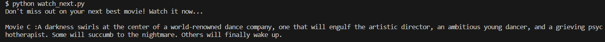

# Watch Next
This script can be used to give a movie recommendation based on the similarity between movie descriptions.

## Running files in a Virtual Environment
Create a local directory in which this repository will be cloned.
Once this repository is cloned in the local directory, navigate to the 'semantics' folder - the cloned repository.

(Change the description assigned to movie_just_watched variable as desired)

(Update movies.txt file with any additional movie description)

Run this command to install and activate a virtual environment:

pip install venv --user

python -m venv virtual_environment_name

(Windows) source virtual_environment_name/Scripts/activate
(Linux) source virtual_environment_name/bin/activate

Now that the virtual environment is activated, run these commands to prepare to run the main python file:

pip install -r requirements.txt

python -m spacy download en_core_web_md

The environment is now fully set up. Run the main python file:

python watch_next.py

## Running files using Docker
Create a local directory in which this repository will be cloned.
Once this repository is cloned in the local directory, navigate to the 'semantics' folder - the cloned repository.

Build docker container with the following command:

docker build -t image_name 

(The spacy library is quite a large library so don't be alarmed when the docker container takes a while to build)

Once the docker container with its image has been built, run the main python file with this command:

docker run image_name

## Code output

Here is the output of the code:

